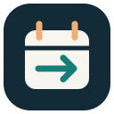
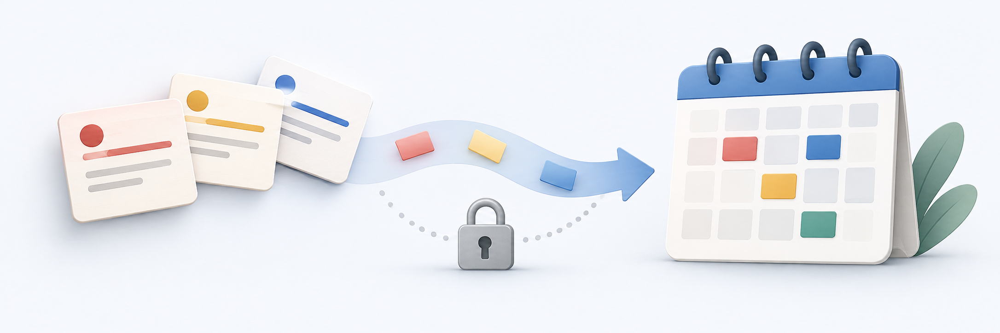
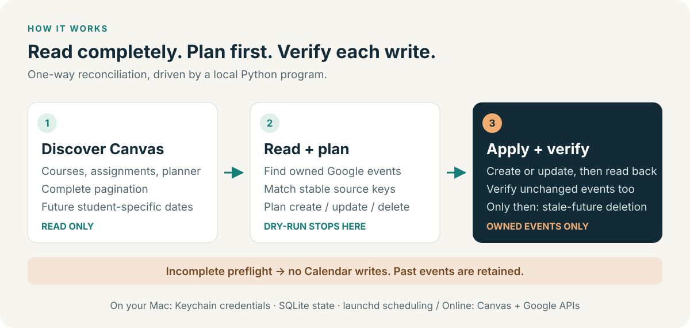

<a id="readme-top"></a>

<div align="center">
  
  <h1>Canvas Calendar Sync</h1>
  <p>Coursework deadlines, in the calendar you already use.</p>
  <p>A local, one-way Canvas → Google Calendar sync for macOS. No LLM at runtime.</p>
  <p>
    <a href="docs/GOOGLE_SETUP.md"><strong>Explore the setup guide »</strong></a>
    <br><br>
    <a href="#usage">See an example</a> ·
    <a href="https://github.com/Ducksss/canvas-calendar-sync/issues/new?template=bug_report.md">Report a bug</a> ·
    <a href="https://github.com/Ducksss/canvas-calendar-sync/issues/new?template=feature_request.md">Request a feature</a>
  </p>
  <p>
    <a href="https://github.com/Ducksss/canvas-calendar-sync/actions/workflows/tests.yml"></a>
    <a href="pyproject.toml"></a>
    <a href="#prerequisites"></a>
    <a href="LICENSE"></a>
  </p>
</div>



<details>
<summary>Table of contents</summary>

- [About the project](#about-the-project)
  - [Features](#features)
  - [What gets synced](#what-gets-synced)
  - [Built with](#built-with)
- [Getting started](#getting-started)
  - [Prerequisites](#prerequisites)
  - [Installation](#installation)
- [Usage](#usage)
  - [Command reference](#command-reference)
  - [How it works](#how-it-works)
  - [Automatic daily execution](#automatic-daily-execution)
- [Safety and limits](#safety-and-limits)
- [Roadmap](#roadmap)
- [Contributing](#contributing)
- [License](#license)
- [Contact](#contact)
- [Acknowledgments](#acknowledgments)

</details>

## About the project

Canvas coursework can be spread across assignments, quizzes, discussions and
planner items. This tool brings the deadlines exposed by those APIs into one
owned Google Calendar, then keeps its events up to date.

It runs directly on your Mac with your own credentials. There is no hosted
backend, shared developer OAuth client, browser extension or graphical app.
**Early release:** macOS and Python 3.11 are supported; institutional API access
varies. This is a reminder aid, not a substitute for official course requirements.

### Features

- **One-way deadline sync:** create upcoming events and update the same events
  when Canvas changes a title or due date. Calendar edits never change Canvas.
- **Your institution and timezone:** configure a Canvas HTTPS origin, owned
  calendar, IANA timezone and daily execution time.
- **Preview before writing:** dry-run discovery and create/update/delete counts.
- **Calendar-friendly reminders:** private, Free, 15-minute events; reminders
  24 hours and 1 hour before; no guests or meeting links.
- **Daily local automation:** launchd execution, missed-run catch-up and a
  once-per-local-day success guard. Codex does not need to be running.
- **Guarded reconciliation:** hidden ownership markers, complete discovery
  before writes, read-back verification and retention of past events.
- **Local credentials and state:** macOS Keychain, isolated profiles, SQLite,
  rotating structured logs and bounded retries at API/credential boundaries.

### What gets synced

| Canvas source | Behavior |
| --- | --- |
| Published assignments in active student courses | Future deadlines with student-specific dates returned by Canvas |
| Graded quizzes, discussions and external-tool work | Included when represented as assignments |
| Relevant dated planner items | Quizzes, discussions, peer reviews, sub-assignments and course-linked notes |
| Submitted coursework | Still visible; submission does not remove its deadline |
| Duplicate quiz/discussion planner representations | Deduplicated against assignments; distinct peer-review dates remain |
| Module pages, syllabuses, attachments and external websites | Not crawled; dates hidden there cannot be inferred |
| Ordinary classes, announcements and wiki pages | Not imported |

### Built with

| Component | Role |
| --- | --- |
| [Python 3.11](https://www.python.org/) + [uv](https://docs.astral.sh/uv/) | CLI and locked environment |
| [Canvas REST API](https://developerdocs.instructure.com/services/canvas) | Read-only coursework discovery |
| [Google Calendar API](https://developers.google.com/workspace/calendar/api/guides/overview) | Owned-calendar event reconciliation |
| [google-auth-oauthlib](https://github.com/googleapis/google-auth-library-python-oauthlib) + [keyring](https://github.com/jaraco/keyring) | Desktop authorization and Keychain storage |
| [SQLite](https://www.sqlite.org/) + macOS launchd | Local state and daily execution |

<p align="right"><a href="#readme-top">Back to top ↑</a></p>

<a id="quick-start"></a>

## Getting started

### Prerequisites

- A Mac with Git and [uv](https://docs.astral.sh/uv/getting-started/installation/).
  The locked environment uses Python 3.11.
- A Canvas account whose institution permits personal access tokens and API access.
- A Google account, a calendar you own and a Google Cloud project you control.
- A browser and an interactive terminal for the one-time credential setup.

### Installation

Clone into a stable folder that can remain available to the scheduler:

```sh
git clone https://github.com/Ducksss/canvas-calendar-sync.git
cd canvas-calendar-sync
uv sync --locked
uv run --locked canvas-calendar-sync init \
  --canvas-url https://canvas.example.edu \
  --timezone America/New_York
uv run --locked canvas-calendar-sync setup-canvas
```

Replace the example URL with your institution's HTTPS origin (no `/api` or course
path) and choose your IANA timezone. Create a token in Canvas account settings if
permitted. `setup-canvas` uses a hidden prompt and stores it in Keychain; never
paste it into a command argument, issue or commit.

Follow the [Google setup guide](docs/GOOGLE_SETUP.md) to enable the Calendar API,
configure consent and download a **Desktop app** client-secrets JSON outside the
checkout. Then authorize and preview:

```sh
uv run --locked canvas-calendar-sync setup-google --client-secrets /private/path/client-secrets.json
uv run --locked canvas-calendar-sync probe
uv run --locked canvas-calendar-sync sync --dry-run --json
```

Replace the example file path. Setup imports the client ID, client secret and
refresh token into Keychain; access tokens stay in memory. Remove the downloaded
JSON yourself after successful import.

The scope is `calendar.events.owned`, not Gmail access. External OAuth apps left
in Testing receive seven-day refresh tokens for this scope; resolve publishing
and consent requirements for daily use. See the
[Google setup guide](docs/GOOGLE_SETUP.md#2-configure-oauth-consent) for the scope
boundary and [Google's expiration guidance](https://developers.google.com/identity/protocols/oauth2#expiration).

`init` never overwrites an existing profile. The default destination is `primary`;
use `--calendar-id` during initialization for another owned calendar. For
multiple profiles or an older personal installation, read the
[configuration guide](docs/OPERATIONS.md#configuration-and-profiles) and
[migration notes](docs/MIGRATION.md) before running both versions.

<p align="right"><a href="#readme-top">Back to top ↑</a></p>

## Usage

Review the dry-run's counts and source keys, especially planned deletions. It
reads both APIs and records a local run, but makes no Calendar changes. When the
plan looks right, run the live sync:

```sh
uv run --locked canvas-calendar-sync sync --json
uv run --locked canvas-calendar-sync status --json
```

Illustrative live-sync result with invented counts, not a recorded account run:

```json
{
  "ok": true,
  "dryRun": false,
  "courseCount": 2,
  "itemCount": 3,
  "ownedEventCount": 3,
  "counts": {"create": 1, "update": 0, "delete": 0, "unchanged": 2, "retainPast": 0}
}
```

A fictional event would look like this; this is text, not a product screenshot:

```text
[Canvas] BIO101 — Lab report due
18 Sep, 17:00–17:15 · Private · Free
Course: Introduction to Biology
Canvas: https://canvas.example.edu/courses/123/assignments/456
Synced automatically from Canvas.
```

### Command reference

Use `uv run --locked canvas-calendar-sync COMMAND` from the checkout.

| Command | Purpose | Calendar writes? |
| --- | --- | --- |
| `init --canvas-url URL --timezone ZONE` | Create a non-secret profile | No |
| `setup-canvas` | Store a token through a hidden prompt | No |
| `setup-google --client-secrets PATH` | Browser authorization and Keychain import | No |
| `probe` | Check Canvas and Calendar access | No |
| `sync --dry-run --json` | Preview complete reconciliation | No |
| `sync --json` | Run immediately | Yes |
| `sync --scheduled --json` | Respect the daily guard and retry cooldown | When due |
| `status --json` | Read run history and query owned events | No |
| `install-schedule [--dry-run]` | Preview/write a LaunchAgent, without loading it | No |

Use `--help` or `COMMAND --help` for all options. `probe` and `status` need
network access. A probe does not test full course discovery; the dry-run does.
In status output, inspect `lastRun.status`, `lastSuccessfulLocalDate` and any
`calendarError`, not just top-level `ok`.

### How it works



The diagram summarizes reconciliation. The scheduler and credentials stay local;
the two APIs still require internet access. Earlier successful writes are not
rolled back if a later write fails. See the
[safety details](docs/OPERATIONS.md#safety-and-limits).

### Automatic daily execution

After a successful manual sync:

```sh
uv run --locked canvas-calendar-sync install-schedule --dry-run
uv run --locked canvas-calendar-sync install-schedule
```

Run the exact `loadCommand` returned by installation. It writes the plist but
does not load it automatically. Keep this checkout and virtual environment in
place. The default sync time is **03:00 in your configured timezone**.

A lightweight local check runs every minute and at login/load; it is not a
minute-by-minute API sync. After a successful sync that local day, it skips.
Failed scheduled attempts have a one-hour cooldown. The Mac must be logged in,
awake, online and able to access Keychain. Catch-up runs when eligible again.

For timezone/DST behavior, alternate profiles, logs, credentials, unloading and
uninstalling the job, see the [operations guide](docs/OPERATIONS.md).

<a id="configuration-and-profiles"></a>
<a id="status-and-troubleshooting"></a>

Configuration and troubleshooting details now live in the
[operations guide](docs/OPERATIONS.md#status-and-troubleshooting).

<p align="right"><a href="#readme-top">Back to top ↑</a></p>

## Safety and limits

- Canvas discovery and Calendar ownership reads must complete before mutations.
  Denied access is an error, not an empty set of deadlines.
- Only automation-owned future events absent from complete discovery are
  deletion candidates. Past events are retained.
- Duplicate ownership or read-back mismatch stops reconciliation. Ambiguous
  inserts can still cause duplicates; this is not an exactly-once transaction.
- Module-only or external-tool-only dates cannot be discovered. Planner discovery
  looks at least 550 days ahead; assignments have no equivalent future cutoff.
- Windows/Linux support, a hosted service and automatic legacy migration are not
  included. Multi-account isolation has [specific constraints](docs/OPERATIONS.md#configuration-and-profiles).

Read the full [safety and retry behavior](docs/OPERATIONS.md#safety-and-limits)
and [security policy](SECURITY.md) before connecting real accounts.

## Roadmap

Shipped capabilities:

- [x] Configurable institution, calendar, timezone and isolated local profiles
- [x] Keychain setup, dry-run reconciliation and daily launchd scheduling
- [x] Offline regression suite and hosted macOS CI

Potential contributions—not promised features or scheduled releases:

- [ ] Additional institution-specific fixtures and compatibility reports
- [ ] Explicitly verified legacy-event migration
- [ ] Additional platform credential and scheduler backends

Discuss proposals in [feature requests](https://github.com/Ducksss/canvas-calendar-sync/issues/new?template=feature_request.md)
before implementation. The [issue tracker](https://github.com/Ducksss/canvas-calendar-sync/issues)
is the place for proposed changes and known problems.

## Contributing

Start with [CONTRIBUTING.md](CONTRIBUTING.md). Fork the repository, make a focused
branch, add regression coverage for behavior changes and open a pull request with
verification evidence.

```sh
uv sync --locked
uv run --locked pytest
uv run --locked python -m compileall -q src tests
uv build
```

Tests use temporary profiles and fake service boundaries, not real credentials
or calendars. [GitHub Actions](https://github.com/Ducksss/canvas-calendar-sync/actions/workflows/tests.yml)
runs the offline suite, compilation and build for PRs and `main`. Passing tests
does not prove every institution permits API access. See the
[release checklist](docs/PUBLIC_RELEASE.md) before publishing artifacts.

## License

Source is distributed under the [MIT license](LICENSE). Original visual assets,
their provenance and edit instructions are documented in [assets/README.md](assets/README.md).

This project is not affiliated with Instructure, Google or any institution.

## Contact

For project support, use [GitHub issues](https://github.com/Ducksss/canvas-calendar-sync/issues).
Use [SECURITY.md](SECURITY.md) for suspected vulnerabilities. Never post tokens,
OAuth downloads, raw API responses, student records or unredacted logs.

## Acknowledgments

- [Best-README-Template](https://github.com/othneildrew/Best-README-Template) by
  othneildrew, for the README structure; its template is provided under the Unlicense.
- [Instructure](https://developerdocs.instructure.com/services/canvas) and
  [Google Calendar API documentation](https://developers.google.com/workspace/calendar/api/guides/overview).
- [Shields.io](https://shields.io/) for status and technology badges.

The cover is an original AI-generated concept illustration, not a screenshot.
The icon and workflow diagram are editable, repository-native SVGs.

<p align="right"><a href="#readme-top">Back to top ↑</a></p>
